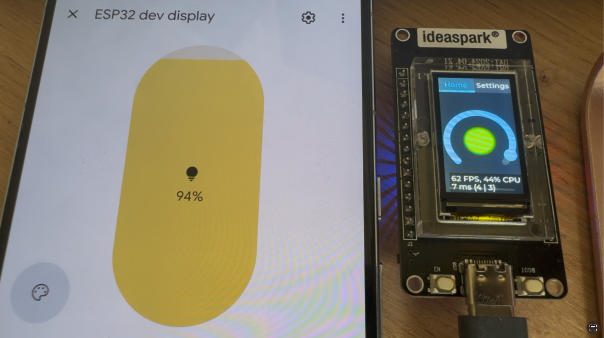

# Google home Matter device with display

This is fun little project with ESP32 and Matter protocol, emulating the ligth device but using a display to show the changes instead. 

Developed to explore the ESP32 capabilities and how to connect it to my Google Home.

## Demo 



## SDKs

| SDK/Library          | Version  |
|-----------------------|----------|
| Espressif IDF        | 5.5.0    |
| Espressif Matter     | 1.4.0    |
| LVGL                 | 9.2      |
| LovyanGFX            | 1.0       |

## Tools

```
# MFG TOOL
https://github.com/espressif/esp-matter/blob/main/tools/mfg_tool/README.md


# Generating QR code 
https://docs.espressif.com/projects/esp-matter/en/latest/esp32/faq.html#a1-10-how-to-generate-matter-onboarding-codes-qr-code-and-manual-pairing-code
https://github.com/project-chip/connectedhomeip/tree/master/src/setup_payload/python

```
